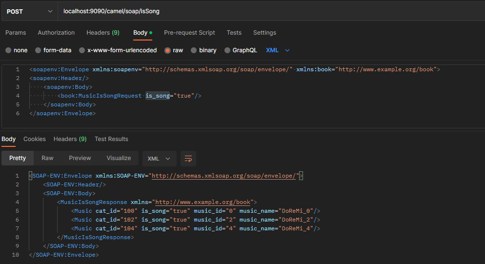

# SOAP

Notes for calling SOAP with camel.

## 1. Maven Dependencies

 Inside **pom.xml**

```xml
<!-- Inside <dependencies> -->
<dependency>
	<groupId>org.apache.camel</groupId>
	<artifactId>camel-cxf</artifactId>
	<version>3.14.5</version>
</dependency>

<dependency>
	<groupId>org.springframework.boot</groupId>
	<artifactId>spring-boot-starter-web-services</artifactId>
</dependency>

```

```xml
<!-- Inside <plugins> -->
<plugin>
	<groupId>org.apache.cxf</groupId>
	<artifactId>cxf-codegen-plugin</artifactId>
	<version>3.5.4</version>
	<executions>
		<execution>
			<id>generate-sources</id>
			<phase>generate-sources</phase>
			<configuration>
				<wsdlOptions>
					<wsdlOption>
						<wsdl>src/main/resources/wsdl/MusicService.wsdl</wsdl>
					</wsdlOption>
				</wsdlOptions>
			</configuration>
			<goals>
				<goal>wsdl2java</goal>
			</goals>
		</execution>
	</executions>
</plugin>
```

Where <wsdl> tag define the `.wsdl` file path located in the project.

## 2. About .wsdl

<details>
    <summary><b>Example code</b> (click to open)</summary>

    ```xml
    <?xml version="1.0" encoding="UTF-8" standalone="no"?>
    <wsdl:definitions xmlns:soap="http://schemas.xmlsoap.org/wsdl/soap/"
                      xmlns:tns="http://www.example.org/book"
                      xmlns:wsdl="http://schemas.xmlsoap.org/wsdl/"
                      xmlns:xsd="http://www.w3.org/2001/XMLSchema"
                      name="MusicService" targetNamespace="http://www.example.org/book">
        <wsdl:documentation>SOAP Definition for Book</wsdl:documentation>
        <wsdl:types>
            <xsd:schema>
                <xsd:import namespace="http://www.example.org/book" schemaLocation="Music.xsd"/>
            </xsd:schema>
        </wsdl:types>
        <wsdl:message name="MusicByIdRequest">
            <wsdl:part name="parameters" element="tns:MusicByIdRequest"/>
        </wsdl:message>
        <wsdl:message name="MusicByNameRequest">
            <wsdl:part name="parameters" element="tns:MusicByNameRequest"/>
        </wsdl:message>
        <wsdl:message name="MusicIsSongRequest">
            <wsdl:part name="parameters" element="tns:MusicIsSongRequest"/>
        </wsdl:message>
        <wsdl:message name="MusicResponse">
            <wsdl:part name="parameters" element="tns:MusicResponse"/>
        </wsdl:message>
        <wsdl:message name="MusicListResponse">
            <wsdl:part name="parameters" element="tns:MusicListResponse"/>
        </wsdl:message>
        <wsdl:message name="MusicIsSongResponse">
            <wsdl:part name="parameters" element="tns:MusicIsSongResponse"/>
        </wsdl:message>
    
        <!--This element defines the service operations and the combination of input and output elements to clients-->
        <wsdl:portType name="MusicServicePortType">
            <wsdl:operation name="GetMusicById">
                <wsdl:input message="tns:MusicByIdRequest"/>
                <wsdl:output message="tns:MusicResponse"/>
            </wsdl:operation>
            <wsdl:operation name="GetMusicListByName">
                <wsdl:input message="tns:MusicByNameRequest"/>
                <wsdl:output message="tns:MusicListResponse"/>
            </wsdl:operation>
            <wsdl:operation name="GetMusicIsSong">
                <wsdl:input message="tns:MusicIsSongRequest"/>
                <wsdl:output message="tns:MusicIsSongResponse"/>
            </wsdl:operation>
        </wsdl:portType>
    
        <!-- This element provides specific details on how an operation will actually be transmitted over the network-->
        <wsdl:binding name="MusicServiceSOAP" type="tns:MusicServicePortType">
            <soap:binding style="document" transport="http://schemas.xmlsoap.org/soap/http"/>
            <wsdl:operation name="GetMusicById">
                <soap:operation soapAction="http://www.example.org/book/GetMusicById"/>
                <wsdl:input>
                    <soap:body use="literal"/>
                </wsdl:input>
                <wsdl:output>
                    <soap:body use="literal"/>
                </wsdl:output>
            </wsdl:operation>
            <wsdl:operation name="GetMusicListByName">
                <soap:operation soapAction="http://www.example.org/book/GetMusicListByName"/>
                <wsdl:input>
                    <soap:body use="literal"/>
                </wsdl:input>
                <wsdl:output>
                    <soap:body use="literal"/>
                </wsdl:output>
            </wsdl:operation>
            <wsdl:operation name="GetMusicIsSong">
            <soap:operation soapAction="http://www.example.org/book/GetMusicIsSong"/>
            <wsdl:input>
                <soap:body use="literal"/>
            </wsdl:input>
            <wsdl:output>
                <soap:body use="literal"/>
            </wsdl:output>
            </wsdl:operation>
        </wsdl:binding>
    
        <!-- Definition of the service and the endpoint. -->
        <wsdl:service name="MusicService">
            <wsdl:port name="MusicServiceSOAP" binding="tns:MusicServiceSOAP">
                <soap:address location="http://localhost:5000/soap/service/book"/>
            </wsdl:port>
        </wsdl:service>
    </wsdl:definitions>
    ```
</details>

<details>
    <summary>code 2</summary>

    ```xml
    <?xml version="1.0" encoding="UTF-8"?>
    <xs:schema xmlns:xs="http://www.w3.org/2001/XMLSchema"
               xmlns:vc="http://www.w3.org/2007/XMLSchema-versioning"
               xmlns:n1="http://www.example.org/book" targetNamespace="http://www.example.org/book" elementFormDefault="qualified" attributeFormDefault="unqualified" vc:minVersion="1.1">
        <!--    <xs:element name="Bookshelves">-->
        <!--        <xs:annotation>-->
        <!--            <xs:documentation>Bookshelves information</xs:documentation>-->
        <!--        </xs:annotation>-->
        <!--        <xs:complexType>-->
        <!--            <xs:sequence maxOccurs="unbounded">-->
        <!--                <xs:element ref="n1:Book"/>-->
        <!--            </xs:sequence>-->
        <!--            <xs:attribute name="cat_id" type="xs:long" use="required"/>-->
        <!--            <xs:attribute name="cate" type="xs:string" use="required"/>-->
        <!--            <xs:attribute name="location" type="xs:string" use="required"/>-->
        <!--        </xs:complexType>-->
        <!--    </xs:element>-->
        <xs:element name="Music">
            <xs:annotation>
                <xs:documentation>Book information</xs:documentation>
            </xs:annotation>
            <xs:complexType>
                <xs:attribute name="music_id" type="xs:long" use="required"/>
                <xs:attribute name="music_name" type="xs:string" use="required"/>
                <xs:attribute name="is_song" type="xs:boolean" use="required"/>
                <xs:attribute name="cat_id" type="xs:string" use="optional"/>
            </xs:complexType>
        </xs:element>
        <xs:element name="MusicResponse">
            <xs:complexType>
                <xs:sequence minOccurs="0">
                    <xs:element ref="n1:Music"/>
                </xs:sequence>
            </xs:complexType>
        </xs:element>
        <xs:element name="MusicListResponse">
            <xs:complexType>
                <xs:sequence minOccurs="0" maxOccurs="unbounded">
                    <xs:element ref="n1:Music"/>
                </xs:sequence>
            </xs:complexType>
        </xs:element>
        <xs:element name="MusicByIdRequest">
            <xs:annotation>
                <xs:documentation>Query book by Id</xs:documentation>
            </xs:annotation>
            <xs:complexType>
                <xs:attribute name="music_id" type="xs:long" use="required"/>
            </xs:complexType>
        </xs:element>
        <xs:element name="MusicByNameRequest">
            <xs:annotation>
                <xs:documentation>Query an book</xs:documentation>
            </xs:annotation>
            <xs:complexType>
                <xs:attribute name="music_name" type="xs:string" use="required"/>
            </xs:complexType>
        </xs:element>
        <xs:element name="MusicIsSongRequest">
            <xs:annotation>
                <xs:documentation>Query an book</xs:documentation>
            </xs:annotation>
            <xs:complexType>
                <xs:attribute name="is_song" type="xs:boolean" use="required"/>
            </xs:complexType>
        </xs:element>
        <xs:element name="MusicIsSongResponse">
            <xs:complexType>
                <xs:sequence minOccurs="0" maxOccurs="unbounded">
                    <xs:element ref="n1:Music"/>
                </xs:sequence>
            </xs:complexType>
        </xs:element>
    </xs:schema>
    ```
</details>
    

As the targetNamespace (http://www.example.org/book) is a dummy path, a `.xsd` is defined for that with schemaLocation.

Inside `Music.xsd` , defined classes of Music, 3 of the requests and responses.

The structure in `MusisService.wsdl` : **service → binding → portType → operation → message**

Java class files would be generated after maven compile.

## 3. BackendService Class

This is a class to pretend the data storage, with functions to get back the data requested.

```java
//Making up data
private List<Music> musicList = new ArrayList<Music>();

@PostConstruct
public void init(){
    for(int x=0;x<5;x++){
        Music music = new Music();
        music.setMusicId(x);
        music.setMusicName("DoReMi_" + x);
        music.setCatId(Integer.toString(100+x));
        music.setIsSong(x%2 == 0 ? true : false);
        musicList.add(music);
    }
}
```

```java
//example of returning requested data
List<Music> getMusicIsSong(Boolean isSong){
        List<Music> list = new ArrayList<Music>();
        for (Music m: musicList){
            if(m.isIsSong() == isSong)
                list.add(m);
        }
        return list;
    }
```

## 4. MusicEndPoint Class

This class implements the generated PortType interface.

```java
@Autowired
BackendService service;

//One of the example function
@Override
public MusicResponse getMusicById(MusicByIdRequest param){
    MusicResponse musicResponse = new MusicResponse();
    musicResponse.setMusic(service.getMusicById(param.getMusicId()));
    return musicResponse;
}
```

## 5. Camel Route to call SOAP

Construct a route, enter the `.process` to retrieve the parameters inside a SOAP request. where `process(exchange, new {Request_Constructer})` is a helper function. Then direct the route to a bean to handle the request.

```java
from("direct:music_name")
        .process(exchange -> {process(exchange, new MusicByNameRequest());})
        .to("bean:soapBean?method=nameResponse(${body})");
```

```java
private void process(Exchange exchange, Object req) throws Exception{
    SOAPMessage message = MessageFactory.newInstance().createMessage(null, new ByteArrayInputStream(exchange.getIn().getBody(String.class).getBytes()));
    JAXBContext jaxbContext = JAXBContext.newInstance(req.getClass());
    Unmarshaller unmarshaller = jaxbContext.createUnmarshaller();
    req = req.getClass().cast(unmarshaller.unmarshal(message.getSOAPBody().extractContentAsDocument()));
    exchange.getMessage().setBody(req);
}
```

- Alternative could implement the processor inside the route.
    
    ```java
    from("direct:music_id")
            //Alternative:
            .process( exchange -> {
                SOAPMessage message = MessageFactory.newInstance().createMessage(null, new ByteArrayInputStream(exchange.getIn().getBody(String.class).getBytes()));
                JAXBContext jaxbContext = JAXBContext.newInstance(MusicByIdRequest.class);
                Unmarshaller unmarshaller = jaxbContext.createUnmarshaller();
                MusicByIdRequest musicByIdRequest = (MusicByIdRequest) unmarshaller.unmarshal(message.getSOAPBody().extractContentAsDocument());
                exchange.getMessage().setBody(musicByIdRequest);
            })
            .to("bean:soapBean?method=idResponse(${body})");
    ```
    

## 6. Bean handling SOAP

Linked to the `MusicEndPoint` class for handling the incoming request, returning the corresponding responses.

```java
@Autowired
MusicEndPoint endPoint;

//example function
public String nameResponse(MusicByNameRequest req) throws ParserConfigurationException, SOAPException, JAXBException, IOException {
    MusicListResponse res = endPoint.getMusicListByName(req);
    return buildingSoap(res);
}
```

Helper function for building a SOAP response.

```java
private String buildingSoap(Object res) throws ParserConfigurationException, JAXBException, SOAPException, IOException {
    Document document = DocumentBuilderFactory.newInstance().newDocumentBuilder().newDocument();
    JAXBContext jaxbContext = JAXBContext.newInstance(res.getClass());
    Marshaller marshaller = jaxbContext.createMarshaller();
    marshaller.marshal(res, document);

    SOAPMessage message = MessageFactory.newInstance().createMessage();
    message.getSOAPBody().addDocument(document);
    ByteArrayOutputStream outputStream = new ByteArrayOutputStream();
    message.writeTo(outputStream);
    String output = new String(outputStream.toByteArray());
    return output;
}
```

## 7. Calling RESTful POST

```java
//define the RESTful url
rest("/soap")
        .post("/id")
        .to("direct:music_id")

        .post("/name")
        .to("direct:music_name")

        .post("/isSong")
        .to("direct:music_isSong");
```



Testing SOAP in Postman