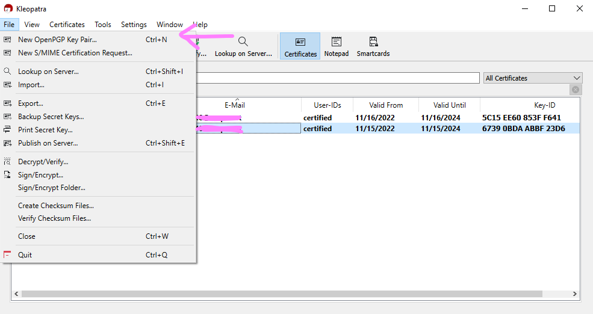

# JCE & PGP

Notes for message encryption and decryption with JCE (Java Cryptiographic Extension) and PGP (Pretty Good Privacy).

<br>
## 1. Maven Dependencies

```xml
<dependency>
	  <groupId>org.bouncycastle</groupId>
	  <artifactId>bcprov-ext-jdk15on</artifactId>
	  <version>1.68</version>
</dependency>
<dependency>
    <groupId>org.bouncycastle</groupId>
    <artifactId>bcprov-jdk15on</artifactId>
    <version>1.68</version>
</dependency>
<dependency>
    <groupId>org.apache.camel</groupId>
    <artifactId>camel-crypto</artifactId>
    <version>3.14.5</version>
</dependency>
```

<br>
## 2. Key Generation

Download [Kleopatra](https://gpg4win.org/get-gpg4win.html) for key generating. Go to **File** > **New OpenPGP KeyPair…**



Select **RSA** or **DSA**, click the checkbox if you need a passphrase.


To export the keys, right click the key, save them in *.gpg* format.

- choose **Export…** for the public key
- choose **Backup Secret Keys…** for secret key
    
    
<br><br>
## 3. Define paths/parameters

```java
// Constants
final String publicKeyFile = "file:C:\\Users\\Desktop\\Keys\\public_key.gpg";
final String secretKeyFile = "file:C:\\Users\\Desktop\\Keys\\secret_key.gpg";
final String keyUserid = "name <email@email.com>";
final String keyPassword = "YOUR_PASSWORD";

//keyUserid need to match the Name & Email address declared while key generated
```


## 4. Simple file encryption & decryption

### 4.1. with .pgp()

```java
// Method 1 (with .pgp())
// - Encryption Route
from("file:C:\\Users\\Name\\Desktop\\secure\\encrypt\\input")
  .marshal().pgp(publicKeyFile, keyUserid)
  .to("file:C:\\Users\\Name\\Desktop\\secure\\encrypt\\output");

// - Decryption Route
from("file:C:\\Users\\Name\\Desktop\\secure\\decrypt\\input")
  .unmarshal().pgp(secretKeyFile, keyUserid, keyPassword)
  .to("file:C:\\Users\\Name\\Desktop\\secure\\decrypt\\output");
```

### 4.2. Using [PGPDataFormat](https://camel.apache.org/components/3.14.x/dataformats/pgp-dataformat.html)

```java
Map<String, String> userId2Passphrase = new HashMap<String, String>(1);
userId2Passphrase.put(keyUserid, keyPassword);
PGPPassphraseAccessor passphraseAccessor = new DefaultPGPPassphraseAccessor(userId2Passphrase);

//Store the info inside PGPDataFormat
PGPDataFormat encrypt = new PGPDataFormat();
encrypt.setKeyUserid(keyUserid);
encrypt.setKeyFileName(publicKeyFile);
encrypt.setSignatureKeyFileName(publicKeyFile);

PGPDataFormat decrypt = new PGPDataFormat();
decrypt.setPassphraseAccessor(passphraseAccessor);
decrypt.setKeyFileName(secretKeyFile);
decrypt.setSignatureKeyFileName(secretKeyFile);
```

```java
// Method 2 (with PGPDataFormat)
// - Encryption Route
from("file:C:\\Users\\Name\\Desktop\\secure\\encrypt\\input")
  .marshal(encrypt)
  .to("file:C:\\Users\\Name\\Desktop\\secure\\encrypt\\output");

// - Decryption Route
from("file:C:\\Users\\Name\\Desktop\\secure\\decrypt\\input")
  .unmarshal(decrypt)
  .to("file:C:\\Users\\Name\\Desktop\\secure\\decrypt\\output");
```


## 5. Message Encryption & Decryption

### 5.1. Using PGPDataFormat

```java
from("direct:pgp")
	      .setBody(simple("This is the testing message."))
	      .log("Message before encryption:  ${body}")
	      .marshal(encrypt)
	      .log("Message AFTER encryption:  ${body}")
	      .unmarshal(decrypt)
	      .log("Message AFTER DECRYPTION:  ${body}");
```

### 5.2. Using [JCE](https://camel.apache.org/components/3.14.x/dataformats/crypto-dataformat.html) for Key Generation

```java
try {
    KeyGenerator keyGenerator = KeyGenerator.getInstance("DES");
    CryptoDataFormat cryptoDataFormat = new CryptoDataFormat("DES", keyGenerator.generateKey());

    from("direct:jce")
            .setBody(simple("This is the testing message for JCE."))
            .log("Message before JCE encryption:  ${body}")
            .marshal(cryptoDataFormat)
            .log("Message AFTER JCE encryption:  ${body}")
            .unmarshal(cryptoDataFormat)
            .log("Message AFTER JCE DECRYPTION:  ${body}");
}catch (Exception e){}
```


#### Reference

[https://dzone.com/articles/pgp-encryption-and-decryption-with-apache-camel](https://dzone.com/articles/pgp-encryption-and-decryption-with-apache-camel)